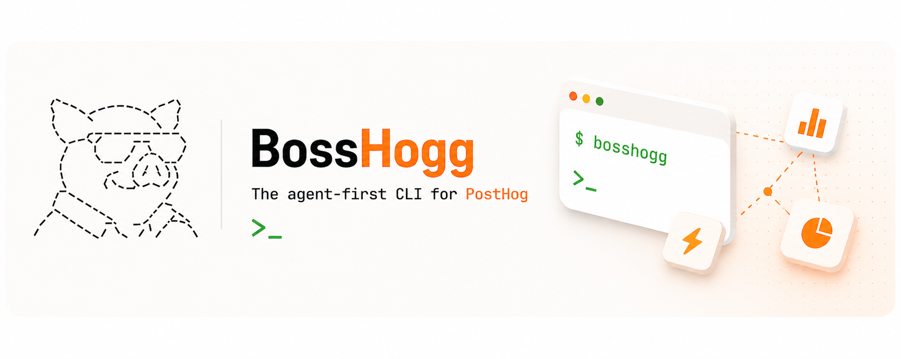

<p align="center">
  
</p>

<h1 align="center">BossHogg</h1>

<p align="center">
  <strong>The agent-first PostHog CLI.</strong><br>
  PostHog power, right in your prompt.
</p>

<p align="center">
  <a href="https://github.com/aaronkwhite/bosshogg-cli/actions"></a>
  <a href="https://crates.io/crates/bosshogg"></a>
  <a href="https://github.com/aaronkwhite/homebrew-tap"></a>
  
  
  
</p>

Query events with HogQL, manage feature flags, inspect persons and cohorts, debug insights, and operate 31 PostHog resources from your terminal — or from Claude Code, Cursor, and other coding agents. Ships a Claude Code skill that loads at **~200 idle tokens** instead of the **~44,000 tokens** the PostHog MCP server costs every agent session.

<details>
<summary>Table of contents</summary>

- [Quickstart](#quickstart)
- [Why BossHogg over the PostHog MCP server?](#why-bosshogg-over-the-posthog-mcp-server)
- [Built for coding agents](#built-for-coding-agents)
- [What BossHogg does](#what-bosshogg-does)
- [Safety](#safety)
- [Install](#install)
- [Positioning](#positioning)
- [Status & roadmap](#status--roadmap)
- [Documentation](#documentation)
- [Credits](#credits)
- [License](#license)

</details>

## Quickstart

```bash
brew install aaronkwhite/tap/bosshogg   # or: cargo install bosshogg
bosshogg configure                       # interactive: host, API key, default project
bosshogg doctor                          # verify setup — all checks green?
bosshogg flag list --active --json | jq '.[0]'
```

Output:

```json
{
  "id": 12345,
  "key": "checkout-redesign",
  "active": true,
  "rollout_percentage": 25,
  "filters": { "groups": [] }
}
```

**Tip — add a `bh` shortcut.** Symlink is friendliest to subshells and agent loops (which often don't load your shell config):

```bash
ln -s "$(command -v bosshogg)" /usr/local/bin/bh   # or anywhere on PATH
# alternative (shells only): echo 'alias bh=bosshogg' >> ~/.zshrc
```

Then `bh flag list`, `bh query run "SELECT …"`, etc.

<p align="center">
  
</p>

## Why BossHogg over the PostHog MCP server?

The PostHog MCP server is excellent for wizard-driven flows and chart rendering in the web UI. For agent loops, the token overhead is the tradeoff:

| | PostHog MCP | BossHogg skill |
|---|---|---|
| Idle context size | ~44,000 tokens | ~200 tokens (frontmatter only) |
| Full surface loaded | Always | On-demand (references loaded per task) |
| Design target ratio | 1x | ~220x cheaper at idle |
| Chart rendering | Yes | No — use MCP or web UI |
| Terminal / CI use | No | Yes |
| Multi-context | No | Yes (kubectl-style `use <context>`) |

The idle-token figure for the PostHog MCP server comes from independent benchmarks (including the Scalekit gh-vs-GitHub-MCP 32x benchmark for equivalent surfaces). BossHogg's ~200-token target is based on the skill frontmatter size; actual measurement should be performed before each release.

## Built for coding agents

BossHogg ships with a Claude Code skill at `.claude/skills/bosshogg/`. Instead of loading a 44,000-token tool surface into every session, your agent loads ~200 tokens of frontmatter and pulls reference docs on demand.

```
> Use bosshogg to find the top 5 events by volume in the last 7 days
```

The agent calls:

```bash
bh query run "SELECT event, count() FROM events WHERE timestamp > now() - INTERVAL 7 DAY GROUP BY event ORDER BY count() DESC LIMIT 5" --json
```

And returns the structured result. No web UI hop. No browser. No idle context tax.

**MCPs and CLIs are not competitors — they serve different jobs.** MCP is great for rich, hosted, chart-rendering workflows. BossHogg is for terminal ops, CI scripts, and the tight agent loops where you want a small, predictable command surface.

## What BossHogg does

All 31 GA PostHog resources + 1 nested group (Personal API Key-accessible):

**M1 — Core (v2026.4.0)**
- **HogQL first.** `bosshogg query run "SELECT ..."` — sync or async, auto-`LIMIT 100` for safety, file/stdin input, table or JSON output.
- **Feature flag management, CRUD-deep.** `bosshogg flag list / get / create / update / delete` — list, toggle, rollout, inspect filters & payloads.
- **Agent utilities.** `bosshogg doctor` (preflight health check), `bosshogg schema hogql` (grounds models on your schema), `bosshogg auth token` (escape hatch for `curl`).
- **Multi-project, multi-region contexts.** US, EU, and self-hosted in one kubectl-style config.

<details>
<summary>Full resource catalog (M2–M10)</summary>

**M2 — Org & project (v2026.4.1)**
- `bosshogg org` — list, get, current, switch.
- `bosshogg project` — list, get, current, switch, reset-token.

**M3 — Analytics backbone (v2026.4.2)**
- `bosshogg insight` — list, get, refresh, create, update, delete (soft), tag, activity, share.
- `bosshogg dashboard` — list, get, refresh, create, update, delete (soft), share, plus `tiles add` and `tiles remove`.
- `bosshogg cohort` — list, get, create, update, delete (soft), members, add-person, remove-person, calculation-history, activity.

**M4 — People & events (v2026.4.3)**
- `bosshogg person` — list, get, delete (hard/GDPR), update-property, delete-property, activity, split.
- `bosshogg group` — list, find, property-definitions, property-values, related, activity, update-property, delete-property.
- `bosshogg event` — list (HogQL), get, values, tail (5s-poll loop).
- `bosshogg action` — list, get, create, update, delete (soft), references, tag.
- `bosshogg annotation` — list, get, create, update, delete (soft).

**M5 — Taxonomy (v2026.4.4)**
- `bosshogg event-definition` — list, get, update, delete, by-name, tag.
- `bosshogg property-definition` — list, get, update, delete, seen-together, tag.
- `bosshogg endpoint` — list, get, create, update, delete, run, materialize-preview, materialize-status, openapi.

**M6 — Growth primitives (v2026.4.5)**
- `bosshogg experiment` — list, get, create, update, delete, archive, duplicate, copy-to-project, create-exposure-cohort, launch, end, pause, resume, reset, ship-variant, recalculate-timeseries, results.
- `bosshogg survey` — list, get, create, update, delete, activity, duplicate, archive-response, stats, project-stats, responses-count, project-activity, summarize.
- `bosshogg early-access` — list, get, create, update, delete.
- `bosshogg query ai-costs` — per-model LLM cost aggregate from `$ai_generation` events (default 30d window).

**M7 — CDP pipeline (v2026.4.6)**
- `bosshogg hog-function` — list, get, create, update, delete (soft), enable, disable, invoke, logs, metrics, enable-backfills.
- `bosshogg batch-export` — list, get, create, update, delete, pause, unpause, plus nested `backfills` and `runs`.

**M8 — Ops & debug (v2026.4.7)**
- `bosshogg session-recording` — list, get (snapshot blob written to `--out` file, never stdout), update, delete.
- `bosshogg error-tracking` — nested `fingerprints`, `assignment-rules`, `grouping-rules`, `issues` (list, get, activity, activity-list, assign, cohort, merge, split, bulk), `releases` (list, get, by-hash), `symbol-sets` (list, get, download, start-upload, finish-upload, bulk-delete, bulk-start-upload, bulk-finish-upload), plus resolve-github / resolve-gitlab.
- `bosshogg role` — Enterprise RBAC, list/get/create/update/delete, plus member management.
- `bosshogg capture` — event / batch / identify via the public ingest endpoint (uses project token, gated on `--yes`).

**M9 — v1.x candidates (v2026.4.6)**
- `bosshogg alert` — list, get, create, update, delete. Insight-threshold monitors.
- `bosshogg dashboard-template` — list, get, create, use (instantiate a dashboard from a template).
- `bosshogg session-recording-playlist` — list, get, create, update, delete, recordings, add-recording, remove-recording.
- `bosshogg insight-variable` — list, get, create, update, delete. Templated HogQL variables.

**M10 — Deep LLM analytics (v2026.4.8)**
- `bosshogg dataset` — list, get, create, update, delete. Eval datasets at `/api/projects/{proj}/datasets/`.
- `bosshogg dataset-item` — list (with optional `--dataset` filter), get, create, update, delete. Input/output pairs for evaluation datasets.
- `bosshogg evaluation` — list, get, test-hog. `test-hog` runs Hog evaluation code against recent `$ai_generation` events and returns pass/fail results synchronously.
- `bosshogg llm-analytics` — nested group with 5 sub-resources:
  - `models list` — available LLM models for the configured provider.
  - `evaluation-summary` — AI-powered summary of evaluation results (pass/fail patterns + recommendations).
  - `evaluation-reports` — CRUD + `generate` (async trigger) + `runs` (history). 7 verbs.
  - `provider-keys` — `list`, `get`, `validate` (read + validate only; write paths deferred).
  - `review-queue list` — LLM analytics review queue items.

</details>

**Agent-native output throughout.** `--json` everywhere, stable schemas validated in CI, structured errors `{error, code, message, hint, retry_with}`, deterministic exit codes (10 auth / 20 not-found / 30 bad-request / 40 rate-limit / 50 upstream / 60 schema-drift / 70 internal).

## Safety

Security and data-safety properties baked in from day one:

- **HTTPS-only.** `reqwest` is configured with `.https_only(true)` in all release builds. The `BOSSHOGG_ALLOW_HTTP` escape hatch is feature-gated behind `test-harness` and never compiled into release binaries.
- **Auth redaction.** `Authorization:` headers are stripped from `--debug` output. Error bodies are truncated to 200 chars. No tokens or PII leak to logs.
- **Soft-delete routing.** Resources that PostHog soft-deletes (flags, insights, dashboards, cohorts, actions, annotations, hog-functions) are routed through the correct soft-delete path. Hard-delete resources (persons, event-definitions, etc.) are routed correctly and gated on `--yes` or interactive TTY confirmation.
- **HogQL auto-LIMIT.** `bosshogg query run` auto-injects `LIMIT 100` when the query has no LIMIT clause. Bypass with `--no-limit` intentionally. Injection is logged in `--debug`.
- **Snapshot never-stdout.** Session recording snapshot blobs are suppressed from stdout by default; use `--out <file>` to write the full blob.
- **`--yes` gating on destructive ops.** Hard deletes and `bosshogg capture` (which writes to real production data) require `--yes` or interactive confirmation. No accidental bulk deletions.
- **Config file at `0600`.** `~/.config/bosshogg/config.toml` is written with `mode(0o600)`. The `configure` command probes `/api/users/@me/` before persisting the key — failed auth never writes secrets to disk.

## Install

**Homebrew** (macOS / Linux, from v2026.4.0):

```bash
brew install aaronkwhite/tap/bosshogg
```

**crates.io:**

```bash
cargo install bosshogg
```

**GitHub Releases** — prebuilt tarballs for `x86_64-unknown-linux-gnu`, `aarch64-unknown-linux-gnu`, `x86_64-apple-darwin`, `aarch64-apple-darwin` are attached to each tag.

**From source:**

```bash
git clone https://github.com/aaronkwhite/bosshogg-cli && cd bosshogg
cargo install --path .
```

## Positioning

BossHogg is **complementary to**, not a replacement for, PostHog's first-party tools:

| Tool | Purpose | When to reach for it |
|---|---|---|
| `@posthog/cli` | Official — source maps, dSYM/ProGuard, release tracking, HogQL | Crash symbolication, release pipelines |
| `posthog-rs` | Official SDK — event capture, remote/local flag eval | Embed analytics in your Rust app |
| PostHog MCP | Official — 100+ tools, hosted server, full web-UI parity | Chart rendering, wizard-driven flows, Max AI |
| **BossHogg** | Community — broad admin/query surface, agent-native, multi-context (~200 idle tokens via skill) | Terminal ops, CI scripts, agent loops, flag management, HogQL |

## Status & roadmap

> **v2026.4.10 — 31 GA PostHog resources covered (+ llm-analytics nested group).**

**v1.0 (v2026.4.0) — M1 through M10 complete.**

- 31 GA PostHog resources + 1 nested group (llm-analytics) implemented across milestones M1–M10 (Personal API Key-accessible only).
- ~508 tests (unit + integration via wiremock, JSON contract validation, HogQL smoke tests).
- Claude Code skill with eval set (≥90% pass rate gate on Opus for release).
- Homebrew tap formula. crates.io publication. Prebuilt tarballs for 4 targets.
- Cross-product playbooks: safe rollout, debug a user, conversion drop, ship an event, LLM debug, incident notebook, GDPR deletion.

**v1.1 (planned):**

- `bosshogg auth login` — browser-based OAuth token flow.
- `bosshogg mcp --stdio` — same binary, stdio MCP transport, exposing every `bosshogg` subcommand as an MCP tool.
- Persistent name→ID cache (XDG cache dir) — in-memory only in v1.
- Keyring integration — plaintext TOML at `0600` is v1; OS keychain v1.1.
- Typed HogQL result rendering — date-column formatting, right-aligned numbers.
- `hog-function` Hog source editing via `$EDITOR`.

## Documentation

Start with [`docs/README.md`](docs/README.md).

- [Vision & positioning](docs/vision-and-positioning.md)
- [V1 scope](docs/v1-scope.md)
- [Capability surface](docs/capabilities.md)
- [Architecture](docs/architecture.md)
- [JSON & error conventions](docs/conventions.md)
- [Agent-first design](docs/agent-first.md)
- [Naming decisions](docs/naming.md)
- [PostHog API notes](docs/api-notes.md)
- [Glossary](docs/glossary.md)
- [Development](docs/development.md)
- [Ecosystem integration](docs/ecosystem-integration.md)

Raw research artifacts (API catalog, competitive landscape, schema drafts) live in [`research/`](research/).

## Credits

Modeled after the `lin` CLI playbook — a Rust CLI for Linear's GraphQL API. Thanks to PostHog for an API that's genuinely pleasant to wrap.

## License

MIT

---

*PostHog is a registered trademark of PostHog, Inc. BossHogg is an independent community tool and is not affiliated with, endorsed by, or sponsored by PostHog, Inc.*
